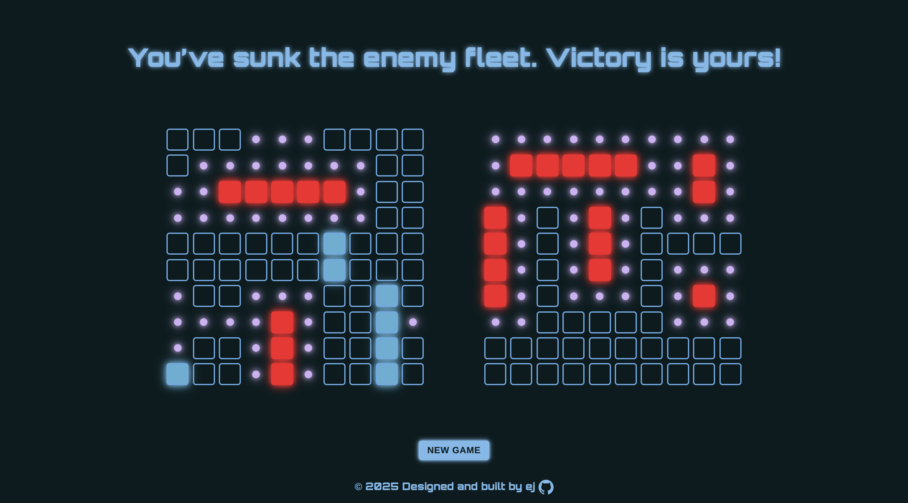

# Project: Battleship 

## Overview

Welcome! 🎯 This repository kickstarts a modern web implementation of Battleship. It’s set up with a lightweight Webpack configuration for both development and production, so you can focus on gameplay and UI while the bundler handles modules, assets, and builds.

[Odin Battleship](https://krig6.github.io/odin-battleship) - A neon-lit naval showdown with drag-and-drop strategy!

## Screenshots

## Technologies Used

- **JavaScript:** Core game logic (ships, boards, turn handling) built with Test-Driven Development.
- **Jest:** Unit testing framework to ensure correctness of game logic (e.g., ship placement, attacks, game flow).
- **Webpack:** Bundles and optimizes all source files for production.
- **CSS:** Custom styling for boards, ships, and game UI. Loaded with css-loader + style-loader.
- **ESLint:** Ensures code quality and consistency.
- **gh-pages:** Deploys the app seamlessly to GitHub Pages.

## Features

- **Interactive Drag-and-Drop Placement:** Ships can be dragged from the dockyard onto the grid, snapping into valid positions with real-time placement previews. Supports both mouse and touch interactions.
- **Rotation Controls:** Ships on the board can be rotated via double-click (desktop) or double-tap (mobile).
- **Placement Validation:** Prevents overlaps, out-of-bounds placements, and enforces spacing between ships with visual feedback (valid = neon green, invalid = red).
- **Dynamic Board Rendering:** Each board cell updates based on hits, misses, and ship positions, with neon visual cues for clarity.
- **Dockyard System:** A dock displays all unplaced ships. Ships disappear from the dock once successfully placed.
- **Game Messages:** Dynamic message area guides the player through ship placement, errors, and game progress.
- **Attackable State Highlighting:** Active player boards are highlighted, while inactive ones are dimmed and protected.
- **Control Buttons:** Randomize, Reset, Start, and New Game buttons provide flexible gameplay control.
- **Touch and Mouse Support:** Full compatibility across devices with double-tap/double-click ship rotation and drag-and-drop support.
- **AI Opponent:** Includes a computer-controlled opponent for Human vs. AI gameplay.
  - *Search Mode:* Randomized attacks weighted toward areas where ships can still fit.
  - *Hunting Mode:* When a hit is found, the AI intelligently targets adjacent cells to sink the ship.
  - *Adaptive Targeting:* Avoids repeated shots on the same cells and adjusts when ships are sunk.
  - *Attack Delay Simulation:* Uses randomized delays (searching: ~1.2–2.5s, hunting: ~0.5–0.9s) to mimic human reaction time.
- **Jest Testing:** Core logic for Player, Gameboard, and Ship classes is covered with Jest unit tests for reliability.
- **Polished UI Styling:** Neon-inspired CSS design with glowing ships, animated buttons, and dynamic hit/miss/dropzone states for an engaging retro aesthetic.

## Learning Path

Working on Battleship was both a challenge and a milestone in my development journey. This project pushed me to combine my knowledge of JavaScript, DOM manipulation, and event handling into a cohesive, fully interactive game. Along the way, I strengthened my skills in:

- **Modular JavaScript:** Organizing code into controllers, utilities, and state management.
- **Single Responsibility Principle:** Breaking complex features (like drag-and-drop placement, rotation, and AI turns) into smaller, testable units.
- **DOM Manipulation & Events:** Managing both mouse and touch interactions for grid snapping, drag-and-drop placement, and double-click rotations.
- **Game State Management:** Consolidating state into a single object (GAME_STATE) and reducing complexity in ship tracking with Sets.
- **AI Implementation:** Designing a computer opponent with search and hunt modes, adaptive targeting, and randomized timing for more human-like gameplay.
- **Debugging & Iteration:** Solving tricky issues with overlapping ships, rotation conflicts, and AI turn timing.

Beyond JavaScript, this project also strengthened my workflow:

- **Linting & Best Practices:** Ensuring code readability and consistency across modules.
- **CSS & UI Design:** Improving layouts with grid systems, responsive styling, and custom animations.

This project taught me the value of iteration—what seemed "done" one day often revealed new opportunities for refinement the next. It also gave me confidence in balancing logic complexity with user experience, especially when handling features like drag-and-drop and AI decision-making.

## Customization

Feel free to modify the configuration files and project structure to fit your specific needs. Whether you're adding new loaders, plugins, or custom scripts, this template is designed to be flexible and easy to extend.

## Contributing

Contributions, bug reports, and feature suggestions are welcome!  

To contribute:  

1. **Fork this repository**  
2. **Create a descriptive feature branch** (e.g., `feat/advanced-ai`, `enhance/mobile-drag`)  
3. **Write or update tests** to cover your changes  
4. **Run the test suite** and ensure all checks pass  
5. **Follow the existing code style and structure**  
6. **Submit a pull request** with a clear explanation of your changes

## Future Enhancements

- **Online Multiplayer:** Play against friends over the internet with real-time matchmaking.  
- **Smarter AI:** Implement adaptive difficulty levels and more advanced attack strategies.  
- **Custom Game Modes:** Timed battles, larger boards, or special ship types for varied gameplay.  
- **Save & Resume:** Ability to save game progress and continue later.  
- **Sound Effects & Music:** Add immersive audio feedback for hits, misses, and game events.  
- **Accessibility Features:** Keyboard-only controls, screen reader support, and high-contrast mode.  
- **Mobile Optimizations:** Enhanced touch interactions, offline play support, and PWA integration.  
- **Theming Options:** Customizable color schemes (e.g., classic navy, neon cyberpunk).  
- **Statistics Tracking:** Win/loss records, hit accuracy, and leaderboards.  

### Resources and Tools

- [The Odin Project](https://www.theodinproject.com/) – Guided full-stack curriculum that inspired the project structure.  
- [Neovim](https://neovim.io/) – Text editor used for coding and workflow efficiency.  
- [Google Fonts](https://fonts.google.com/) – Font resources for UI styling.  
- [Flaticon](https://www.flaticon.com/) – Used for the favicon.
